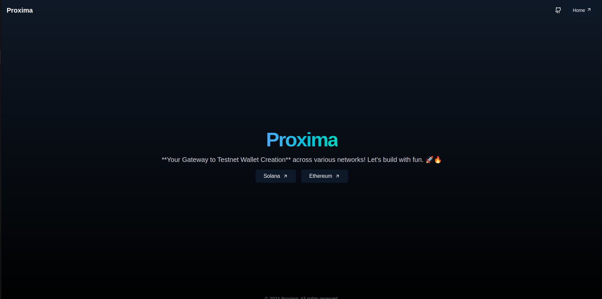

# Proxima Wallet

Welcome to **Proxima Wallet**, a web-based tool for generating disposable testnet wallets. Inspired by temporary email services, Proxima Wallet allows you to create temporary HD wallets with ease, enabling you to test and build your projects effortlessly!

## Features

- **Disposable Testnet Wallets**: Create temporary wallets for Ethereum and Solana without any hassle.
- **HD Wallet Generation**: Easily generate Hierarchical Deterministic (HD) wallets for secure key management.
- **Seamless User Experience**: Built with Next.js and styled using Tailwind CSS for a modern and responsive interface.
- **IndexedDB Support**: Utilize IndexedDB for efficient storage and retrieval of wallet data.

## Technologies Used

- **Next.js**: A React framework for server-rendered applications.
- **TypeScript**: For type safety and improved development experience.
- **ethers.js**: To interact with the Ethereum blockchain.
- **solana@web3.js**: For Solana blockchain interactions.
- **IndexedDB**: For local storage of wallet information.
- **Tailwind CSS**: For a sleek and modern UI.
- **Framer Motion**: For smooth transitions.

## How It Works

Proxima Wallet simplifies wallet generation by providing a user-friendly interface that allows you to create wallets in just a few clicks. With our tool, you can:

1. Generate an HD wallet using a mnemonic phrase.
2. Access your wallets for testing purposes.
3. Receive automatic faucet transfers to your generated wallets.

